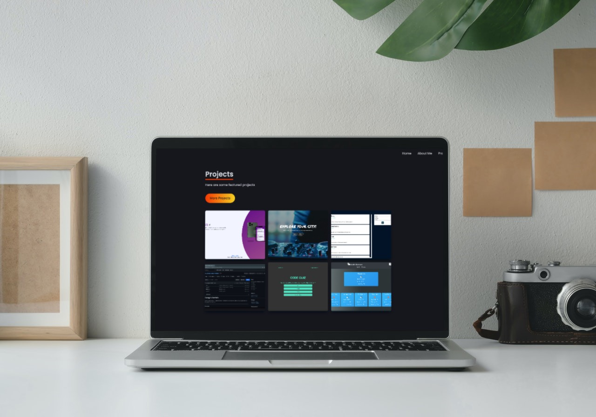

# George's Portfolio

Check out my portfolio! On there you will learn more about me and check out some of the cool projects I've had the opportunity to work on!

---

## License

---

## Table of Contents:

- [License](#license)
- [Links](#links)
- [About Me](#about-me)
- [Questions](#questions)

---

<!-- Add desktop & mobile version mockup -->

## Links

### [Demo](https://github.com/geoescobar/react-portfolio)

### [Github Repo](https://github.com/geoescobar/react-portfolio)

---

## About Me

  <!-- Add about me section here -->

- I am 25 years old from Dallas, TX. I enjoy spending time with my friends and family as well as going out with my two dogs! I have a background in customer service and am recognized as proactive, resourceful, and persistent problem-solver. Excellent communicator with effective client relationship-building skills

- I am a graduate of the Fullstack Development Bootcamp at Southern Methodist University. I enjoy creating immersive front-end code that engages the user in exploring the site to it's fullest.

---

  <!-- Add languages learned here -->

## Skillset pertains of:

| ES6 JavaScript |  React.Js  |
| :------------: | :--------: |
|      HTML      | Express.Js |
|      CSS       | Sequalize  |
|     mySQL      |  MongoDb   |
|    Mongoose    | Bootstrap  |
|    GraphQL     |  Tailwind  |

---

## Questions

#### If you have questions regarding this repository? Below is my contact info:

- [Github Repo](Github.com/geoescobar)
- [Email Me](geo.escobar214@gmail.com)
